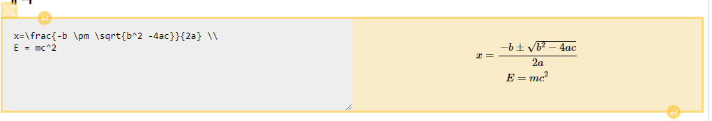

# CKEditor 5 mathwidget

ckeditor5-math is a TeX-based mathematical plugin for CKEditor 5.

derived form 

[ckeditor5-math](https://github.com/isaul32/ckeditor5-math.git) && [ckeditor5-mermaid](https://github.com/ckeditor/ckeditor5-mermaid.git) plugin

## Feature

- Preview / Source View
- multiple equation support  




## Requirements

-   Use same major version as your CKEditor 5 build


```js
import MathWidget from 'ckeditor5-mathwidget/src/mathwidget';
```

Add it to built-in plugins

```js
InlineEditor.builtinPlugins = [
	// ...
	MathWidget
];
```

**Add math button to toolbar**

```js
InlineEditor.defaultConfig = {
	toolbar: {
		items: [
			// ...
			'mathwidget'
		]
	}
};
```

## Configuration & Usage

### Plugin options

```js
InlineEditor.defaultConfig = {
	// ...
	mathwidget: {
		engine: 'mathjax',
		lazyLoad: undefined, // async () => { ... }, called once before rendering first equation if engine doesn't exist. After resolving promise, plugin renders equations.
		outputType: 'script', // or span
	}
}
```

### Available typesetting engines

**MathJax**
-   Tested with **latest 2.7**
-   Has experimental (**CHTML**, **SVG**) support for **3.0.0** or newer version

#### From plain text

Paste TeX equations with **delimiters**. For example:

```latex
\[ x=\frac{-b\pm\sqrt{b^2-4ac}}{2a} \]
```

or

```latex
\( x=\frac{-b\pm\sqrt{b^2-4ac}}{2a} \)
```

To enter a development loop with hot reload support:

-   `git clone https://github.com/isaul32/ckeditor5-math.git`
-   `cd ckeditor5-mathwidget`
-   `yarn`
